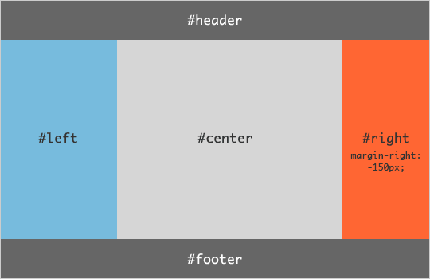

## 经典圣杯布局 ##
> 主要实现三栏布局： 中间内容自适应，左右两侧宽度固定。



**[作者原文](https://alistapart.com/article/holygrail)**

 **特点：**

  - 中间宽度不定，两侧边栏固定宽度
  - 允许中间内容最先渲染
  - 三栏高度固定
  - 只需要外面包裹一个额外的`div`
  - `css`样式非常简单  

**基础HTML**
  ```
  <!-- 头部 -->
  <div id="header"></div>

  <!-- 中间 主体 三栏布局  -->
  <div id="container">
      <!--  中间自适应 内容 -->
      <div id="center" class="column"></div>
      <!-- 左侧边栏 -->
      <div id="left" class="column"></div>
      <!-- 右侧边栏  -->
      <div id="right" class="column"></div>
  </div>

  <!--  尾部 -->
  <div id="footer"></div>

  ```
**CSS 样式**

 - 为左右两栏 留出位置:
   ```
   #container {
       padding-left: 200px;   /* LC width */
       padding-right: 150px;  /* RC width */
    }
   ```
    给最外层的`div` 设置 两侧`padding`,为后面侧边栏保留位置，同时保证中间内容不会被覆盖。

- 三栏保存在同一行，开始会出现换行
  ```
      #container .columns {
          float: left;
          position: relative;
      }
  ```  
  利用`float`浮动，让三栏能够保存在一行，虽然还是会因为宽度不够，左右边栏被挤下去

- 左侧栏设置负边距，被拉到第一行，同时利用`right:200px`相对定位，推到最外面预留的`padding`处。
    ```
        #left {
            width: 200px;        /* LC width */
            margin-left: -100%;  
            right: 200px;        /* LC width */
        }
    ```
- 同样右侧栏设置负边距。
    ```
      #right {
        width: 150px;          /* RC width */
        margin-right: -150px;  /* RC width */
      }
    ```

- 最后，原文中提到设置`min-width`,保证页面宽度变化时，能完全显示。
  ```
    body {
      min-width: 550px;  /* 2x LC width + RC width */
    }
  ```

[完整css 代码](./index.html)
